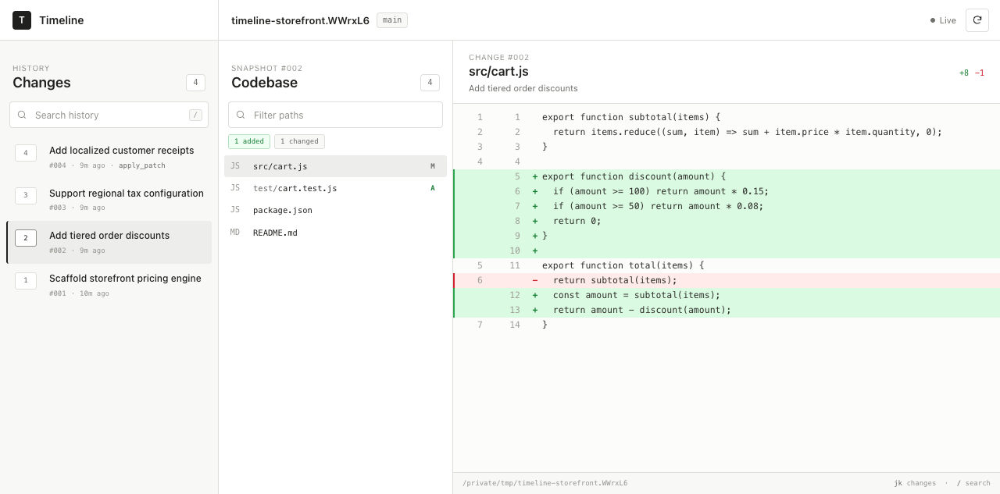

# Timeline

Timeline turns any Git repository into a visual, searchable history in your browser. Install the npm package, run one command inside a codebase, and inspect every commit and recorded coding-agent change without changing your branch, `HEAD`, worktree, or staging area.



## Quick start

Install Timeline globally, move into a Git repository, and run it:

```sh
npm install --global @ketiyohannes/timeline

cd your-codebase
timeline
```

Timeline synchronizes the repository, starts a local server at `http://127.0.0.1:4177`, and opens the browser automatically.

You can also run it without a global installation:

```sh
cd your-codebase
npx @ketiyohannes/timeline
```

Requirements:

- Node.js 18 or newer
- Git 2.20 or newer
- A modern web browser

Timeline has no runtime npm dependencies and requires no editor integration.

## Browser

The browser is organized into three panes:

1. **Changes** — every commit and recorded coding-agent event in chronological order.
2. **Codebase** — the complete repository tree at the selected event.
3. **Code** — the full historical file with that event's changes shown in context.

Diff colors follow the standard convention:

- **Green** marks added files and lines.
- **Red** marks deleted files and lines.
- **Gray** marks modified files, unchanged context, and interface chrome.

The browser also supports:

- filtering changes by sequence, message, or tool;
- filtering the complete historical file tree by path;
- `j` and `k` navigation between changes;
- `/` to focus change search;
- live updates when new Timeline events are recorded; and
- responsive layouts for smaller windows.

All browser assets are served by the installed package. Repository content stays on the local machine.

## Options

Open another repository or choose a different local address:

```sh
timeline --repo /path/to/codebase
timeline --port 4400
timeline --host 127.0.0.1 --no-open
```

`--no-open` starts the server without launching a browser, which is useful for containers and remote development environments.

Run `timeline --help` to see every option and diagnostic command.

## Automatic Codex recording

Existing Git commits appear immediately. To record future Codex edits at tool-call granularity, install the lifecycle hooks once:

```sh
timeline hooks install
```

Open `/hooks` in the Codex CLI, review and approve the six commands ending in `timeline-hook`, then restart Codex.

The installer preserves unrelated handlers and creates a timestamped backup whenever it updates `~/.codex/hooks.json`.

Remove only Timeline's handlers with:

```sh
timeline hooks uninstall
```

## Diagnostic commands

The visual browser is the default. Lower-level commands remain available for scripts and troubleshooting:

| Command | Purpose |
|---|---|
| `timeline sync --repo .` | Import existing commits and current project state |
| `timeline status --repo .` | Show whether automatic recording is enabled |
| `timeline sessions --repo .` | List recorded Timeline refs |
| `timeline list --repo . --session project` | Print events as TSV |
| `timeline list --repo . --session project --json` | Print structured event data |
| `timeline diff 3 --repo . --session project` | Print one event's patch |
| `timeline files 3 --repo . --session project` | Print files changed by one event |
| `timeline context 3 --repo . --session project` | Print stored agent context |
| `timeline disable --repo .` | Pause recording for a repository |
| `timeline enable --repo .` | Resume recording for a repository |

## Node.js API

```js
const {
  Timeline,
  createTimelineServer,
} = require('@ketiyohannes/timeline');

const timeline = new Timeline({
  repo: process.cwd(),
  session: 'project',
});

timeline.sync();
console.log(timeline.list());

const server = createTimelineServer({
  repo: process.cwd(),
  port: 0,
});

server.ready.then(({ url }) => {
  console.log(`Timeline: ${url}`);
});
```

TypeScript declarations are included with the package.

## How storage works

Timeline stores snapshots as commits reachable only through `refs/codex-timeline/*`. It builds each snapshot using a temporary `GIT_INDEX_FILE`, then advances the hidden ref with `git update-ref`.

Timeline does not:

- checkout historical commits;
- change the current branch or `HEAD`;
- modify the normal Git index;
- push Timeline refs with a normal `git push`; or
- upload source code to an external service.

Ignored files are excluded. Untracked, modified, and deleted non-ignored files are included in snapshots.

## Local development

```sh
git clone https://github.com/ketiyohannes/timeline-npm.git
cd timeline-npm
npm link

cd /path/to/your-codebase
timeline
```

Run the complete verification suite with:

```sh
npm test
npm run check
```

The suite verifies Git-state isolation, history import, ordered checkpoints, lifecycle-hook compatibility, HTTP APIs, browser assets, and the packed npm artifact.

## License

MIT
